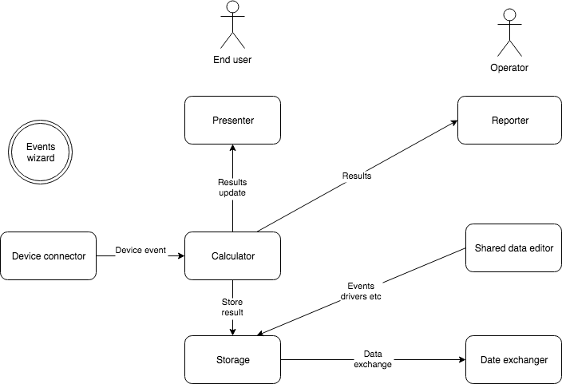

Open Race Timing software
==============

**** THIS IS A DESIGN CONCEPT ***

Why should be all race timing software tightly coupled to one or few sports only? Why should be more ambitious timing 
solution complex? Why are all working timing software
closed-source? How can public make sure that timing is calculated properly if it's sources are not public?

We are trying to answer these questions by modular open-source timing software. Interested? Join us. All kind of experiences welcome!

## Logical modules

* `Device connector` - has a timing device specific connection code and extracts data timing data. Provides device events as soon as device reports passing, sessions or timelines. Also processes commands to the device from user
* `Calculator` - core component of the system - receives events from device and calculates timing data based on sports specific rules
* `Storage` - stores data with a flexible structure. Provides searching, reporting and caching functionalities
* `Presenter` - express calculator's results to timing operator and end user in flexible,multi-platform way
* `Reporter` - express status result, historical data and trends to printer, cloud, social network etc
* `Shared data editor` - is a racers, events, laps, finals and other data editor
* `Data exchanger` - exports/imports data from/to another system, format etc
* `Event wizard` - drivers user from an event creation, data entry and timing processing

Modules are interconnected by flexible, multi-structure, performing bus way. The bus is in memory native communication
among modules based on a standard data structure like JSON. Each module is a micro-service from design pattern point of view.

All modules should be tight together with calculator as it defines data to be calculated for racer and event. Screens and
datastore should be flexible to show and store it. Reporter should has in-place editor to edit reporting layout and connection to
publishing destinations.

Core race event processing component should use `event sourcing` and an essential pattern for race event handling. Events might be handled from 
device to and event store. These should be also published to the bus for another components to recalculate results, 
update result boards, announce changes or even alert a race director if necessary.

## More details of functionality

* Will have racing events editor, with multiple runs per event - the editor will start with event details to setup in database and 
enable racers entry 
* Flexible racers editor - operator's tool to correct racers data
* Web-enabled racers registration - racers should have self-service tool to register to selected race
* Event-specific website generation - this should generate based on event's information, resources, graphics
* Speech processor to express results - to automate on-event publishing of data to amplified speakers   
* Flexible results display with multiple views over mobile, web etc - online automatic results publishing
* Simple clients for mobile client targeted to end users - even specific for the event with event's information, graphics, sponsors etc
* Results filtering on a flexible screen, including results table columns flexible selection
* Plugable calculators for results - covering specific of different sports
* Plugable connectors to different timing devices like MyLaps, RaceResult, Omega and many others
* Device simulator - great for development without read device connection
* Plugable finish line camera connectors
* IoT support - on some events racers carries IoT devices with GPS to monitor during the race 
* Manual counter using keyboard - for sports without a decoder or in the case of decoder failures
* Other devices plugin like shooting gun etc
* Results reporting plugin and editor to publishing results in desired form 
* Reporting for printing, different paper format and printers support using OS based drivers
* In-place editor of report layout for printing
* Support results panel - large on-screen panel support
* Social network connector to publish events about the race
* Plugable import/export data framework to interchange data with external parties like TV broadcasters etc
* Driver search, full text search
* Time schedule planning of the race and important milestones with notifications
* Language editor to support multiple languages
* Driver ranking calculator - based on previous results with manual corrections
* Flexible architecture for client/server setup or client-only setup without internet connection or cloud based
* Flexible data store options from simple file store upto database or cloud store
* Wide platform support, primary platforms: Windows, Mac OS, Chrome/browser
* Secondary platforms: Raspberry Pi, Linux, Android, iOS etc
* Cloud backup to prevent data-loss
* Cloud based analytics of racers result, profiles
* programing language agnostic, micro-service based with clearly defined interfaces 

## Current space fragmentation

* by sport - each sport has different rules of racing and this prevents one race timing app 
be used to more than few sports with similar rules
* by sport association - each professional sport's association certifies different timing app
to be authorized for it's race timing
* by decoder HW producer - each HW producer has a secret or public API how to communicate with it's
HW and creates developers API and communities supporting the HW
* by event size - there are different apps used for small, medium and large events
* by technology - some sports needs passive transponder, some active or specific. Decoders connected
to those transponders have different APIs
* by business - self-service timing app are much different to those used by specialized companies
for race timing
* by deployment type - most of today's racing app has runs on Windows only without internet
access during or post race. Very few supports different platforms or cloud based deployment

Final comment: the top race timing apps are related to Swiss' watch producers to express need of precision and perfectionism
that is actually false association and watches has very little related to race timing. 